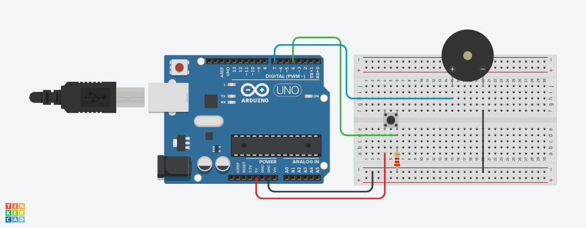
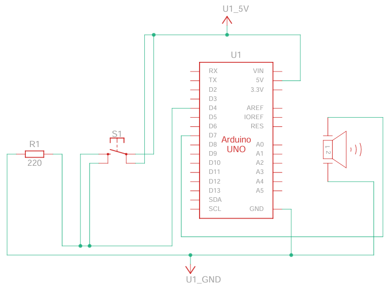

# Button-Controlled Nokia Ringtone using a Passive Buzzer
<p align = "center"> </p>
<p align = "center"><b>Figure 1.</b> Button-controlled passive buzzer circuit created in <a href = "https://www.tinkercad.com">Tinkercad</a>. The circuit along with the code can be tried and tested through this <a href = "https://www.tinkercad.com/things/fQJUkTMgSr4-passive-buzzer-with-nokia-ringtone-and-switch?sharecode=uOHM4dYuI-3O2dUIxWRhOjLuAzRExjSWg6tGPytbvN8">simulation</a>.</p>

# Introduction
I have started to play around with a new electronic component: the passive buzzer. I chose this instead of its active counterpart because it offers more flexibility, such as choosing the tone (_cite or reference because not sure_).

# Methodology
<p align = "center"> </p>
<p align = "center"><b>Figure 2.</b> Electrical connections for the button-controlled passive buzzer circuit created using <h href = "https://www.tinkercad.com">Tinkercad</h>. I used a pullup configuration for the button switch using a 220-&ohm; resistor.</p>
- Passive Buzzer
- Push Button
- (1) 220-&ohm; resistor
- Arduino UNO microcontroller
- Connector wires
- (Optional) Breadboard power supply module

## Code Breakdown
&#x26A0;**IMPORTANT:** _This section is a detailed description of the code and can be skipped to the overall code [here](#overall-code)._

To make a sound, a square wave must be passed into the passive buzzer. The frequency and duration of the passive buzzer can easily be defined using [`tone()`](https://docs.arduino.cc/language-reference/en/functions/advanced-io/tone/) function, which accepts three arguments in the following order: pin number, frequency (in Hz) and duration (in ms). Below we will go step-by-step with the code. We subdivide the code into three parts: parameter initialization, `void setup()`, and `void loop()`.

### Parameter Initialization
We should define first the pin that will feed signal into the passive buzzer:
```c
int buzzpin = 7;
```
Above is the most basic defined parameter. If we would like to add other settings such as ringing the buzzer after pressing a button, then define the pin that detects a pressed button:
```c
int on_switch = 4;
```
The following is just optional but adds an exciting feature. I decided that I would like the buzzer to play the Nokia ringtone whenever the button was pressed. I just googled the key frequencies used and their duration. I was not sure of the exact duration of each note so I just listed a whole number equivalent to the type of musical note used. Then I defined a multiplier (`mult`), which I adjusted while modifying the code to see what value yields the realistic ringtone sound.
```c
int mult = 200; // Multiplier
int freq[13] = {1319, 1175, 740, 831, 1109, 988, 587, 659, 988, 880, 554, 659, 880}; // Key/Note frequencies
int time[13] = {1, 1, 2, 2, 1, 1, 2, 2, 1, 1, 2, 2, 4}; // Key/Note relative duration
```
### `void setup()`
`void setup()` is also an initialization part, but the the previous one is more about defining the variables. In this part, we define whether the pins are input or output.

`buzzpin` is an `OUTPUT` while `on_switch` is `INPUT` because it reads when the switch is pressed:
```c
void setup() {
  // put your setup code here, to run once:
  pinMode(buzzpin, OUTPUT);
  pinMode(on_switch, INPUT);
}
```

### `void loop()`
This is the main part of the code where the electronic circuit operation is executed. The operational lines of code are written inside the `void loop()`'s environment:
```c
void loop() {
  // put your main code here, to run repeatedly:
}
```
For a simple buzzer ringing, we can write the following using `tone()` function:
```c
tone(buzzpin, frequency, duration);
```
With the button, we first read its state:
```c
int val = digitalRead(on_switch);
```
If it is pressed, I put two possible options. First option is just the template below:
```c
tone(buzzpin, 250, 1000);
```
The second one is where the Nokia ringtone is played:
```c
for (int i = 0; i < 13; i++) {
  tone(buzzpin, freq[i], time[i]*mult);
  delay(time[i]*mult);
}
```
I am not particularly sure why do I have to add a `delay()` after each note since in principle, its duration must be taken into account by `tone()` function. However, without, the ringtone sounds a little weird, so I had to add that delay. I am just leaving this as an open question which I will try to understand later on.

Since these possibilities only play if the button is pressed, do not forget to put these codes inside a conditional environment because otherwise, it will continue to play:
```c
if (val == 1) {
  // // Option 1
  // tone(buzzpin, 250, 1000);

  // Option 2
  for (int i = 0; i < 13; i++) {
    tone(buzzpin, freq[i], time[i]*mult);
    delay(time[i]*mult);
  }
}
```

## Overall Code
```c
int buzzpin = 7;
int on_switch = 4;
int mult = 200;
int freq[13] = {1319, 1175, 740, 831, 1109, 988, 587, 659, 988, 880, 554, 659, 880};
int time[13] = {1, 1, 2, 2, 1, 1, 2, 2, 1, 1, 2, 2, 4};
void setup() {
  // put your setup code here, to run once:
  pinMode(buzzpin, OUTPUT);
  pinMode(on_switch, INPUT);
}

void loop() {
  // put your main code here, to run repeatedly:
  // tone(buzzpin, 250);
  
  // For fun
  int val = digitalRead(on_switch);
  if (val == 1) {
    // // Option 1
    // tone(buzzpin, 250, 1000);

    // Option 2
    for (int i = 0; i < 13; i++) {
      tone(buzzpin, freq[i], time[i]*mult);
      delay(time[i]*mult);
    }
  }
}
```

## Problems
One of the problems I think I have with this electronic circuit is that there is interrupt option. Even though I push the button again, the sound is not interrupted or will not restart. I think I should consider an interrupt next time.
